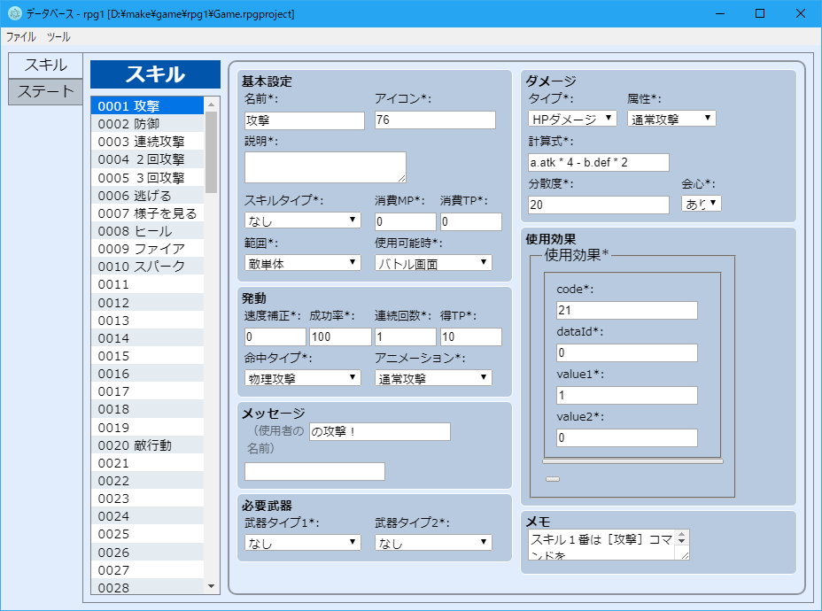

# RPGツクールMVデータベースエディタ

ツクールMV、プラグインで拡張できるのは良いんだけども、エディタが拡張できないのは片手落ちではないかという想いから、カスタマイズ可能なエディタを作るプロジェクト。

HP, MP, TP以外のゲージとか、その他のステータスとか、特殊効果とか、そのままスッと操作したくないです？

**UNDER CONSTRUCTION**



## 開発

```bash
npm install
npm watch
```

## License

[Zlibライセンス](https://narazaka.net/license/Zlib?2018)でリリースされています。
